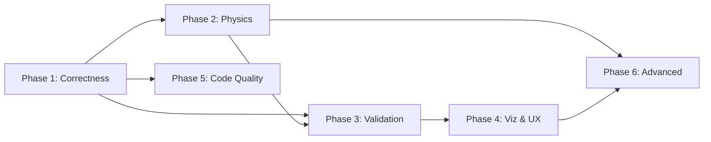

# ResSim Action Plan

Prioritized implementation roadmap derived from [GAP_ANALYSIS.md](GAP_ANALYSIS.md).
Each phase is designed to be independently shippable and builds on the previous one.

---

## Phase 1 — Foundations & Correctness (1–2 days)

> Fix silent numerical issues that affect every simulation run.

- [X] **1.1 Fix saturation-weighted compressibility**
  - File: `src/lib/ressim/src/lib.rs` → `calculate_fluxes()`
  - Change `c_t = c_o + c_w + c_r` to per-cell `c_t = ϕ·(c_o·S_o + c_w·S_w) + c_r`
  - Update Rust unit tests to assert compressibility effect

- [X] **1.2 Audit transmissibility constant**
  - Verify whether `0.001127` or `8.527e-5` matches the intended unit system
  - If incorrect, update `lib.rs:527` and `lib.rs:430` (well PI)
  - Re-run all Buckley-Leverett benchmarks, update tolerances if needed
  - Document decision in `docs/TRANSMISSIBILITY_FACTOR.md`

- [X] **1.3 Add material-balance error tracking**
  - Rust side: compute `ΔV = Σ(injection) − Σ(production) − Σ(ΔS·Vp)` each step
  - Return as new field in `TimePointRates`
  - Worker: pass through to frontend
  - `RateChart.svelte`: add a material-balance error series (new dataset)

- [X] **1.4 PCG solver convergence warning**
  - Return iteration count from `solve_pcg_with_guess()`
  - Log warning to the frontend where status of simulation is shown (Next to "Running simulation...") if solver did not converge

---

## Phase 2 — Core Physics Gaps (2–3 days)

> Unlock realistic heterogeneous reservoir models.

- [ ] **2.1 Per-cell porosity**
  - Add `setPorosityPerLayer(porosities: Vec<f64>)` and `setPorosityUniform(phi: f64)` to Rust
  - Add porosity input to `ReservoirPropertiesPanel.svelte` (uniform / per-layer modes)
  - Wire through `sim.worker.js` payload

- [ ] **2.2 Per-cell initial water saturation**
  - Add `setInitialSaturationPerLayer(sw: Vec<f64>)` to Rust
  - Enables water-oil contact / transition zone initialization

- [ ] **2.3 Dynamic well PI update**
  - Recalculate total mobility at well cell each timestep
  - Update `well.productivity_index` before pressure solve
  - Add test: PI should increase as water (lower viscosity) arrives at producer

- [ ] **2.4 Well BHP min/max constraints in rate mode**
  - When rate-controlled, clamp computed BHP to `[BHP_min, BHP_max]`
  - Switch to BHP-control if constraint is violated (hybrid control)

---

## Phase 3 — Validation & Analytical (1–2 days)

> Strengthen credibility with visible validation.

- [ ] **3.1 Recovery factor vs PV-injected chart**
  - Compute RF = cumulative oil / OOIP, PVI = cumulative injection / pore volume
  - New dataset in `RateChart.svelte`

- [ ] **3.2 Water cut vs PV-injected overlay**
  - Simulated + analytical (from `FractionalFlow.svelte`) on same axis

- [ ] **3.3 Welge f(Sw) diagram**
  - Small Chart.js canvas in `FractionalFlow.svelte`
  - Plot fractional flow curve + tangent line from initial Sw to shock front
  - Display breakthrough PVI, shock Sw, and water cut at breakthrough

- [ ] **3.4 Sw profile along injector-producer axis**
  - 1D line chart showing Sw vs cell index along a user-selected row
  - Compare to analytical flood-front position at current time

- [ ] **3.5 Grid-convergence study preset**
  - Run same scenario at nx = 12, 24, 48, 96 sequentially
  - Overlay breakthrough PVI and recovery curves
  - Show convergence behavior

---

## Phase 4 — Visualization & UX (2–3 days)

> Make the simulator more usable and presentation-ready.

- [ ] **4.1 Cross-section / slice viewer**
  - Add i/j/k slice selector to 3D view
  - Hide cells outside selected slice plane
  - Enables interior inspection of 3D models

- [ ] **4.2 CSV/JSON export**
  - Export buttons for: rate history, grid state snapshot, saturation profile
  - Download triggers via browser Blob API

- [ ] **4.3 Run progress bar**
  - Show steps completed / total, elapsed time, ETA
  - Replace current spinner-only indicator

- [ ] **4.4 A/B run comparison**
  - Store previous run's rate history
  - Overlay on chart as dashed series with label "(previous)"

- [ ] **4.5 Responsive layout improvements**
  - Ensure 3D view and rate chart stack vertically on narrow screens
  - Collapsible sidebar panels on mobile

---

## Phase 5 — Code Quality & DevOps (1 day)

> Reduce tech debt and prevent regressions.

- [ ] **5.1 CI pipeline**
  - GitHub Actions: `cargo test` (Rust) + `npm run build` (frontend) on push/PR
  - Regenerate `benchmark-results.json` and compare to committed version

- [ ] **5.2 Split `lib.rs` into modules**
  - `grid.rs`, `well.rs`, `solver.rs`, `relperm.rs`, `capillary.rs`, `step.rs`
  - Keep `lib.rs` as the public WASM API surface

- [ ] **5.3 Extract simulation state from `App.svelte`**
  - Create `src/lib/stores/simulation.ts` with a Svelte store or context
  - Move state variables, validation, and worker communication out of App

- [ ] **5.4 TypeScript interface for worker payload**
  - Create `src/lib/types.ts` with `CreatePayload`, `RunPayload`, `StateMessage`
  - Import in both `App.svelte` and `sim.worker.js` to enforce contract

- [ ] **5.5 Frontend unit tests**
  - Test `FractionalFlow` analytical calculations
  - Test `validateInputs()` edge cases
  - Use Vitest (already compatible with Vite)

- [ ] **5.6 Update stale documentation**
  - `DOCUMENTATION_INDEX.md`: mark capillary + gravity as completed
  - Remove references to files that no longer exist

---

## Phase 6 — Advanced Physics (ongoing)

> Long-horizon items for deeper capability.

- [ ] **6.1 Aquifer boundary condition** (Carter-Tracy or Fetkovich)
- [ ] **6.2 Partial / selective well completions** (user-selectable k-layers)
- [ ] **6.3 Horizontal well model** (generalized Peaceman PI)
- [ ] **6.4 Non-uniform cell sizes** (local grid refinement around wells)
- [ ] **6.5 Three-phase flow** (oil/water/gas — already `NTH-2` in TODO)

---

## Dependency Graph

> **Phases 1 and 5** can run in parallel. Phases 2–4 depend on Phase 1 correctness fixes. Phase 6 is ongoing and has no deadline.
